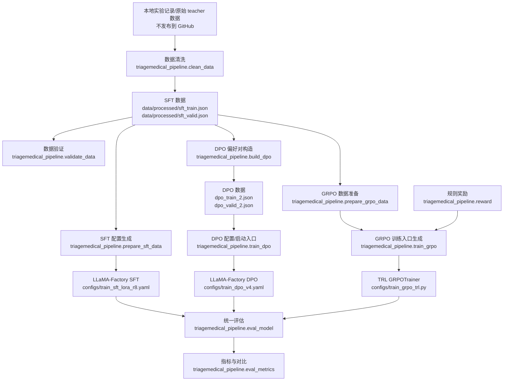

# TriageMedical 结构化分诊实验流水线

本项目是一个中文医疗分诊对齐实验。模型输入患者主诉，输出严格 JSON：

```json
{"department":"消化内科","urgency":"中","symptoms":["胃疼","恶心"]}
```

任务目标是结构化分诊，不是诊断或治疗建议。当前实验链路为：

```text
Base model -> SFT -> failure-driven DPO -> rule/verifier-based GRPO
```

最新主实验 notebook 和历史报告作为本地实验记录保留，不发布到 GitHub 分支。复用和复现实验的正式 Python 流水线位于 `triagemedical_pipeline/`。

## 项目结构

下面只列出发布到 GitHub 的核心项目文件和数据产物，不包含本地 notebook、面试文档、PPT/PDF、reports/outputs、原始 teacher JSON、缓存、权重、checkpoint、wandb、向量库、临时验证输出等内容。

```text
TriageMedical/
├── README.md
├── dpo_train_2.json
├── dpo_valid_2.json
├── configs/
│   ├── default.yaml
│   ├── dataset_info_sft.json
│   ├── train_sft_lora_r8.yaml
│   ├── dataset_info_dpo.json
│   ├── train_dpo_v4.yaml
│   └── train_grpo_trl.py
├── data/
│   └── processed/
│       ├── sft_train.json
│       ├── sft_valid.json
│       ├── sft_all_clean.json
│       ├── sft_clean_report.json
│       └── sft_validation_report.json
├── triagemedical_pipeline/
│   ├── __init__.py
│   ├── config.py
│   ├── constants.py
│   ├── io_utils.py
│   ├── schema.py
│   ├── data_cleaning.py
│   ├── clean_data.py
│   ├── validate_data.py
│   ├── sft.py
│   ├── prepare_sft_data.py
│   ├── dpo.py
│   ├── build_dpo.py
│   ├── grpo_data.py
│   ├── prepare_grpo_data.py
│   ├── reward.py
│   ├── train_dpo.py
│   ├── train_grpo.py
│   ├── eval_metrics.py
│   └── eval_model.py
└── scripts/
    ├── clean_sft_data.py
    ├── validate_sft_data.py
    ├── build_dpo_data.py
    ├── eval_model_full_fixed.py
    ├── eval_model_full_grpo.py
    ├── medical_triage_grpo_reward.py
    └── run_dpo_colab.py
```

## 架构图



## 项目入口

本仓库发布分支只保留正式 Python pipeline；notebook、面试材料、历史报告和演示产物保留在本地工作区，不纳入 GitHub。

- 包入口：`triagemedical_pipeline/`
- 配置入口：`configs/default.yaml`
- 命令行形式：`python -m triagemedical_pipeline.<module>`

## 完整实验流程

这一节把各阶段调用关系和复现实验命令写在同一条主线里：从构建数据集，到注册数据、构建训练配置或脚本，再到评估。默认情况下，数据处理、数据注册、配置生成和保存预测文件评估都是轻量操作；明确标注为“长训练”的命令应只在目标 Colab/GPU 环境中运行。

### 1. 构建并验证 SFT 数据集

```bash
python -m triagemedical_pipeline.clean_data
python -m triagemedical_pipeline.validate_data \
  --sft data/processed/sft_train.json data/processed/sft_valid.json data/processed/sft_all_clean.json \
  --dpo dpo_train_2.json dpo_valid_2.json
```

调用关系与产物：

```text
clean_data.py -> data_cleaning.py -> schema.py
validate_data.py -> schema.py
data/processed/sft_train.json
data/processed/sft_valid.json
data/processed/sft_all_clean.json
```

`data_cleaning.py` 负责读取原始数据、解析 output、schema 校验、科室规范化、去重和 train/valid split。`validate_data.py` 负责验证 SFT/DPO 数据格式。

### 2. 注册 SFT 数据并构建 SFT 训练配置

```bash
python -m triagemedical_pipeline.prepare_sft_data
```

调用关系与产物：

```text
prepare_sft_data.py -> sft.py
configs/dataset_info_sft.json
configs/train_sft_lora_r8.yaml
```

这一步只生成或刷新 LLaMA-Factory 所需的数据注册和训练 YAML，不会启动训练。

长训练入口：

```bash
llamafactory-cli train configs/train_sft_lora_r8.yaml
```

### 3. 构建 DPO 偏好数据集

```bash
python -m triagemedical_pipeline.build_dpo
```

调用关系与产物：

```text
build_dpo.py -> dpo.py -> schema.py
dpo_train_2.json
dpo_valid_2.json
```

`build_dpo.py` 从 SFT 错误输出或合成错误构造 chosen/rejected 偏好对。轻量 smoke test 可以使用：

```bash
python -m triagemedical_pipeline.build_dpo \
  --train-data data/processed/sft_train.json \
  --synthetic-only \
  --max-synthetic 20 \
  --output-dir /tmp/TriageMedical_dpo_smoke
```

### 4. 注册 DPO 数据并构建 DPO 训练配置

```bash
python -m triagemedical_pipeline.train_dpo
```

调用关系与产物：

```text
train_dpo.py -> configs/dataset_info_dpo.json -> configs/train_dpo_v4.yaml
```

`train_dpo.py` 默认只生成配置并打印 LLaMA-Factory 命令，不会启动训练。

长训练入口：

```bash
llamafactory-cli train configs/train_dpo_v4.yaml
```

也可以通过 Python 入口直接触发长训练：

```bash
python -m triagemedical_pipeline.train_dpo --run
```

### 5. 构建 GRPO 数据并生成 GRPO 训练脚本

```bash
python -m triagemedical_pipeline.prepare_grpo_data
python -m triagemedical_pipeline.train_grpo
```

调用关系与产物：

```text
prepare_grpo_data.py -> grpo_data.py -> GRPO prompt/gold 数据
train_grpo.py -> configs/train_grpo_trl.py
configs/train_grpo_trl.py -> reward.py -> TRL GRPOTrainer
```

`prepare_grpo_data.py` 将 SFT 数据转换成 TRL GRPOTrainer 使用的 prompt/gold 格式。`reward.py` 保留 rule-based verifier reward，包括 strict JSON/schema gate、department reward、risk-aware urgency reward、symptom normalized F1 reward。`train_grpo.py` 默认只生成训练入口，不会启动训练。

轻量数据转换检查可以使用：

```bash
python -m triagemedical_pipeline.prepare_grpo_data \
  --sft-data data/processed/sft_train.json \
  --output-path /tmp/TriageMedical_grpo_train.json
```

长训练入口：

```bash
python configs/train_grpo_trl.py
```

也可以通过 Python 入口直接触发长训练：

```bash
python -m triagemedical_pipeline.train_grpo --run
```

### 6. Eval：评估保存预测、模型推理和成对对比

评估保存好的预测文件：

```bash
python -m triagemedical_pipeline.eval_model \
  --predictions-jsonl results/grpo_eval/predictions.jsonl \
  --output-dir results/grpo_eval
```

模型推理评估入口：

```bash
python -m triagemedical_pipeline.eval_model \
  --model-name-or-path deepseek-ai/DeepSeek-R1-Distill-Qwen-1.5B \
  --lora-path /path/to/lora \
  --data-path data/processed/sft_valid.json \
  --output-dir results/sft_eval \
  --use-strong-prompt
```

DPO/GRPO 成对对比入口：

```bash
python -m triagemedical_pipeline.eval_model \
  --compare-baseline predictions_dpo.jsonl \
  --compare-candidate predictions_grpo.jsonl \
  --baseline-name DPO \
  --candidate-name GRPO
```

调用关系：

```text
eval_model.py -> eval_metrics.py -> schema.py
```

指标覆盖 JSON parse rate、schema valid rate、department accuracy、urgency accuracy、urgency macro-F1、high urgency recall、hard jaccard、semantic soft jaccard、normalized symptom F1/Jaccard、save_predictions 和 paired comparison。

历史 notebook 兼容脚本保留在 `scripts/`，例如 `scripts/eval_model_full_fixed.py` 和 `scripts/eval_model_full_grpo.py`。

训练日志上报使用环境变量配置。不要把 WandB key 写入仓库：

```bash
export WANDB_API_KEY=...
export TRIAGEMEDICAL_REPORT_TO=wandb
```

## 当前结果记录

`TriageMedical_datacleaning_deepseek.ipynb` 是最新结果来源。旧 notebook 单元和早期报告中曾记录 GRPO 在原始评估口径下 end-to-end accuracy 为 86.57%；该结果只作为历史/RAG 对照，不作为最终主结果。下面的主线对比采用 SFT r=8、DPO v4 beta2 2 epoch、GRPO r=8 full eval。

| 阶段 | Schema 合法率 | 端到端科室+紧急度准确率 | 科室准确率 cond. | 紧急度准确率 cond. | 症状 Hard Jaccard |
|---|---:|---:|---:|---:|---:|
| Base model | 91.98% | 68.54% | 87.15% | 84.75% | 41.31% |
| SFT r=8 | 99.80% | 84.77% | 93.37% | 91.16% | 67.30% |
| DPO v4 2 epoch | 99.80% | 86.37% | 93.17% | 92.77% | 69.21% |
| GRPO r=8 full eval | 99.80% | 87.17% | 93.37% | 93.17% | 68.63% |

最新 full eval 还补充了风险和症状归一化指标。Base model 没有同一套扩展指标记录，因此用 `—` 标注。

| 阶段 | 紧急度 Macro-F1 | 高紧急度召回 | 高危 -> 中 | 高危 -> 低 | Normalized symptom F1 | Normalized Jaccard | Semantic Soft Jaccard |
|---|---:|---:|---:|---:|---:|---:|---:|
| Base model | — | — | — | — | — | — | — |
| SFT r=8 | 80.93% | 54.84% (17/31) | 14 | 0 | 78.00% | 72.86% | 74.89% |
| DPO v4 2 epoch | 84.62% | 67.74% (21/31) | 10 | 0 | 79.28% | 74.41% | 76.43% |
| GRPO r=8 full eval | 85.56% | 70.97% (22/31) | 9 | 0 | 79.04% | 74.08% | 75.75% |

保守解读是：DPO 是相对 SFT 的主要增益来源；GRPO 在 urgency 和 end-to-end 指标上带来小幅提升，但症状抽取质量存在轻微 trade-off。
